# Gallery

A quick visual tour. Want the **code behind every figure, with its output inline**?
See the **[Showcase](showcase.ipynb)** — it's [`examples/showcase.py`](https://github.com/zlatko-minev/paperplot/blob/main/examples/showcase.py)
executed end to end, with one-click **Open in Colab** / **Binder** links so you can
run it yourself. Everything here is generated by `docs/generate_gallery.py` — no
hand-tuning — and regenerated by CI on every docs build.

## Before / after

The same three-curve plot, same data — stock matplotlib defaults versus one
`pp.use("aps")`. paperplot fixes the column width, type scale, color cycle, tick
style, and line weights in a single call.

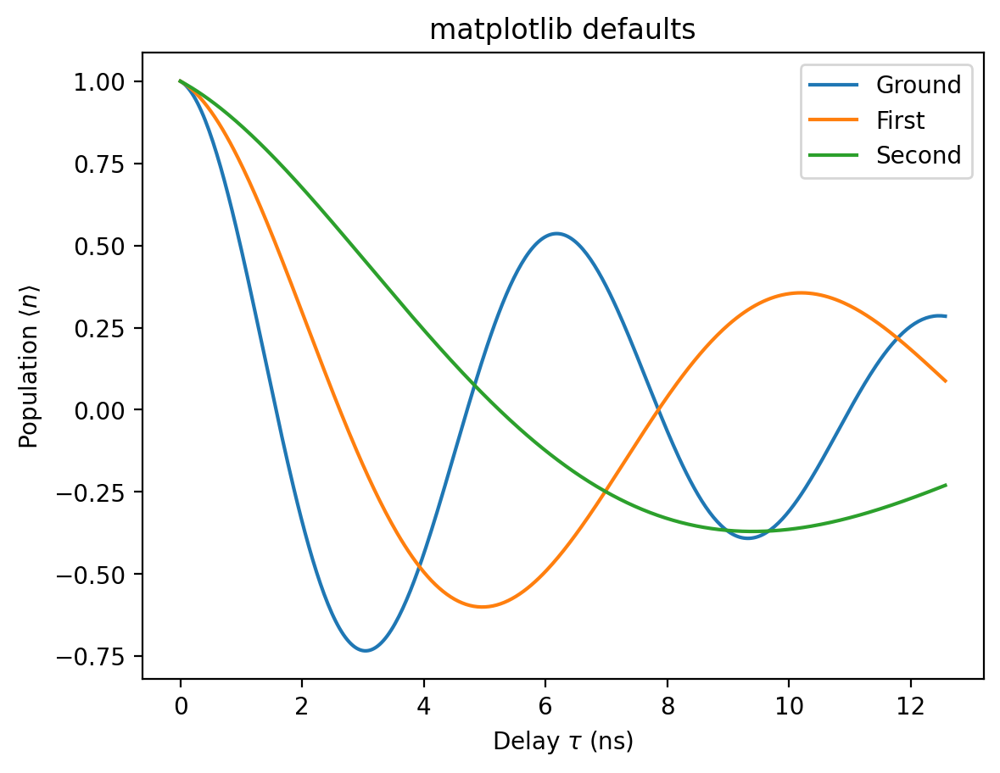{ width="420" }

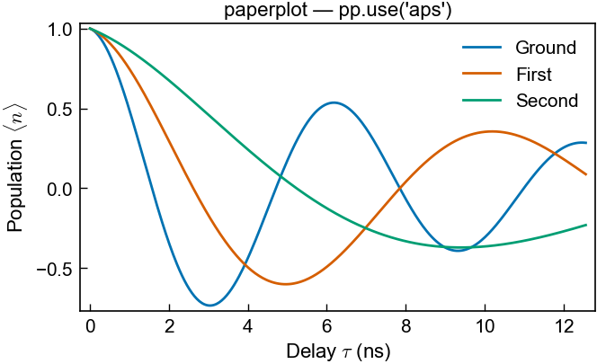{ width="420" }

## Figures

-   **APS, single column (8.6 cm)**

    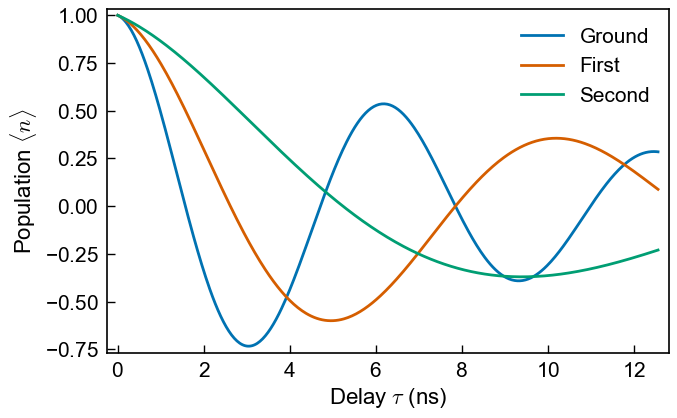

-   **APS, 4-panel single column**

    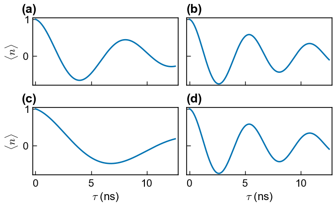

-   **Nature, double column (183 mm)**

    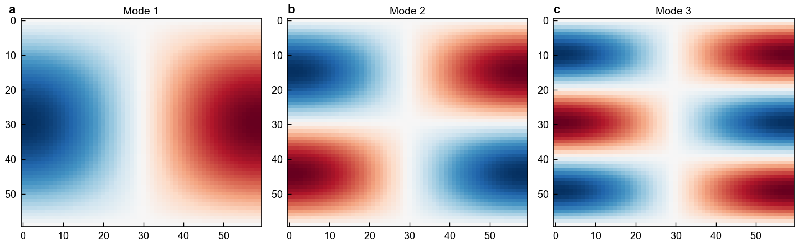

-   **Overlapping outlined histograms**

    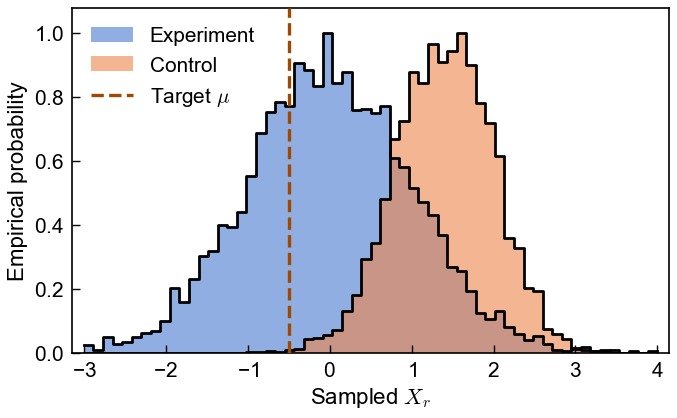

-   **Data + fit + confidence band**

    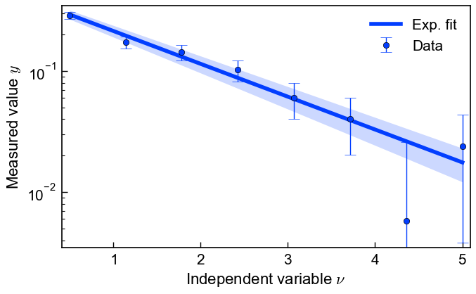

-   **Okabe-Ito, custom palette, sequential cmap**

    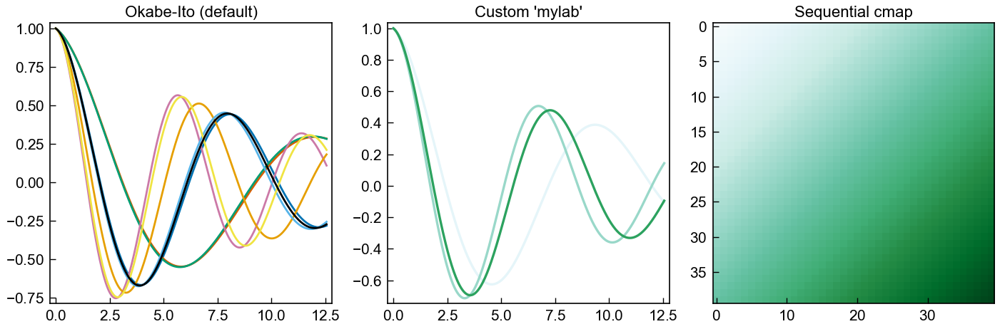

## Math typography

The LaTeX look (Computer Modern) is the default over sans-serif labels — no LaTeX
install required. `math="sans"` pairs sans math with Arial/Helvetica labels.

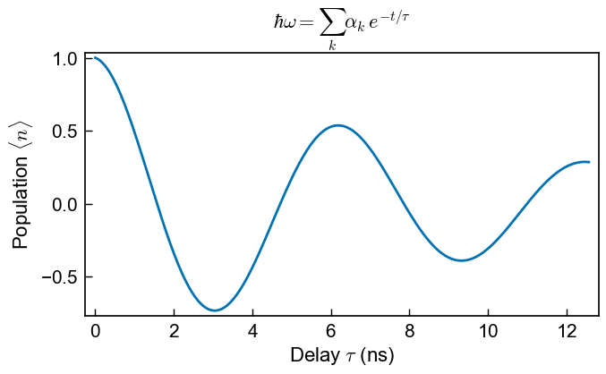{ width="360" }

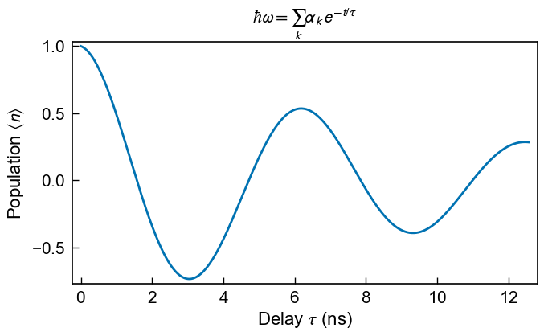{ width="360" }

## On the page

This is the part most styling packages don't do. `preview_in_page()` drops your
figure into a **true-to-scale mock journal page** with real justified body text, so
before you ever submit you can see *exactly* how large it lands in the column and
whether the lettering still reads at that size. Same figures as above — now in
context.

-   **APS single column — in page**

    

-   **Overlapping histograms — in page**

    

-   **Data + fit + band — in page**

    

-   **Double column across both columns — in page**

    

## Proofing

`grayscale_proof()` checks print legibility for the APS H24 (grayscale) reality —
print is still often black-and-white, and colors that look distinct on screen can
collapse to the same gray.

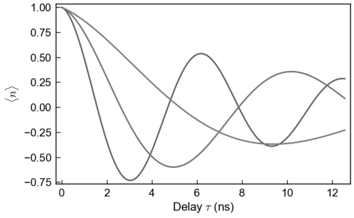{ width="360" }
