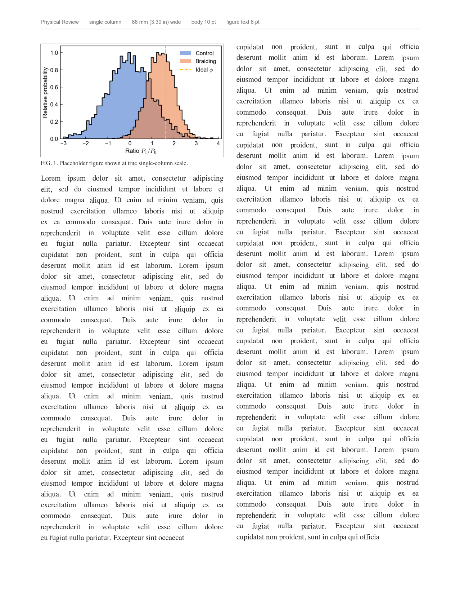
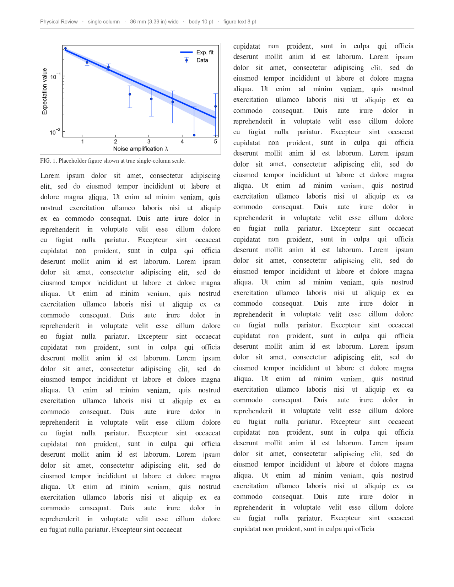
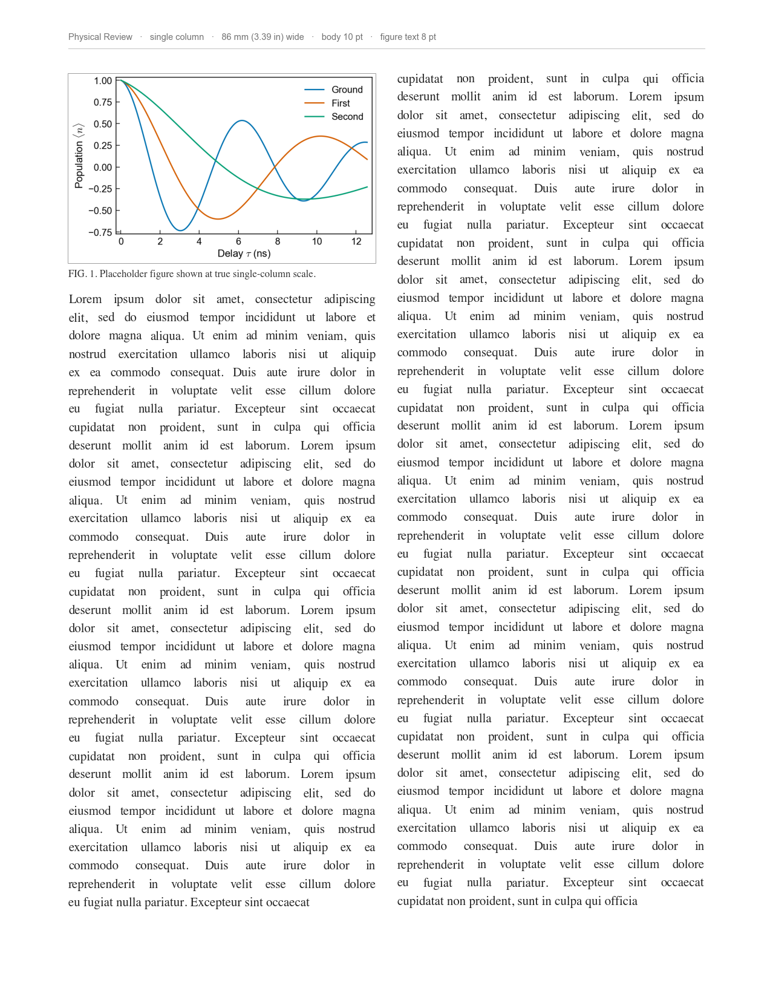
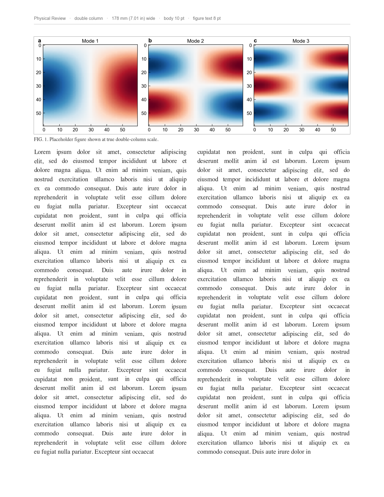

# paperplot

**Publication-correct matplotlib figures, journal by journal.**

Most matplotlib styling focuses on the *look*. `paperplot` does that too — but it
also handles the parts that decide whether a journal accepts your figure:

- **sizes it to the journal's real column width** (8.6 cm, 17.8 cm, …), not a generic default;
- **embeds fonts correctly** (Type-42, no Type-3);
- **preflights it** for the rules figures actually get rejected over — font type,
  line weight, lettering height, and grayscale legibility;
- **shows it on the page before you submit** — `preview_in_page()` drops the
  figure into a true-to-scale mock journal page with real body text, so you see
  exactly how big it lands and whether the lettering holds up. A paperplot
  original — most styling packages stop at the figure. See the
  [Gallery](gallery.md#on-the-page).

Ships **Physical Review (APS)** (incl. PRL/PRX/PRB), **Nature**, and **IEEE**, plus a
**presentation** target for slides.

## The two-call pattern

```python
import numpy as np
import paperplot as pp

pp.use("aps")                          # or "nature" / "ieee" / "prl" / "talk"
fig, ax = pp.figure(width="single")    # 8.6 cm wide, golden ratio, styled
ax.plot(np.linspace(0, 10, 200), np.sin(np.linspace(0, 10, 200)))
ax.set_xlabel(r"delay $\tau$ (ns)")
pp.save(fig, "fig1.pdf")               # embeds fonts, runs preflight()
```

See the [Gallery](gallery.md) for what comes out, and the
[README](https://github.com/zlatko-minev/paperplot#readme) for the full feature tour.

## See it on the page

The part most styling packages skip: `preview_in_page()` drops your figure into a
true-to-scale mock journal page with real body text — so you see exactly how big it
lands and whether the lettering holds up, *before* you submit.

<div class="grid cards" markdown>

-   **Overlapping histograms — in page**

    

-   **Data + fit + band — in page**

    

-   **APS single column — in page**

    

-   **Double column, across the page**

    

</div>

More in the [Gallery](gallery.md#on-the-page).

!!! tip "Just want the look?"
    `pp.register_mplstyles()` then `plt.style.use("paperplot-aps")` — no API to learn.
    You give up only what a style sheet *can't* do (true column sizing, font
    embedding, preflight); `pp.figure()`/`pp.save()` add those back.

## FAQ

**How does this relate to other matplotlib styling packages (e.g. SciencePlots)?**
They're great, and `paperplot` owes a lot to that lineage — if all you want is a
nicer default look, any of them (or our [drop-in style sheets](https://github.com/zlatko-minev/paperplot#drop-in-style-sheets))
will serve you well, and our styles compose just like theirs. `paperplot` adds the
publishing-specific layer on top: figures sized to each journal's true column width,
fonts embedded as Type-42, and a `preflight()` linter for the rules journals reject
figures over. Use whichever fits — they coexist happily.

**Do I need LaTeX installed?** No. The Computer Modern "LaTeX look" is the default
via mathtext, with no LaTeX required. `usetex=True` is there if you want a real
LaTeX engine.

---

<small>Created and maintained by [Zlatko Minev](https://github.com/zlatko-minev).</small>
